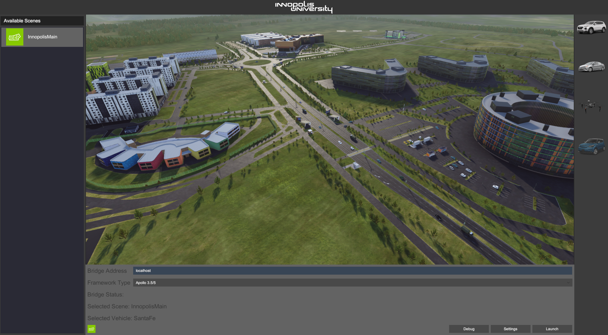
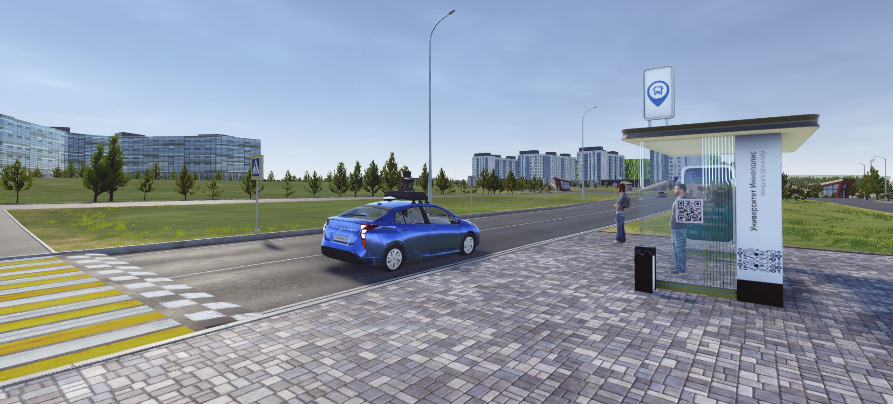
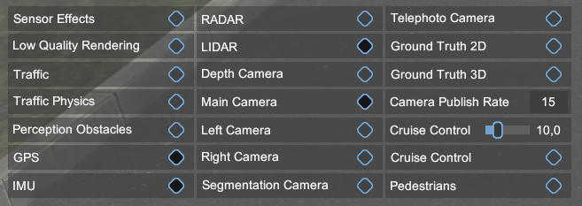
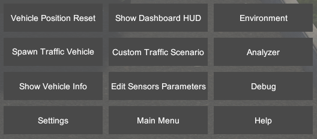
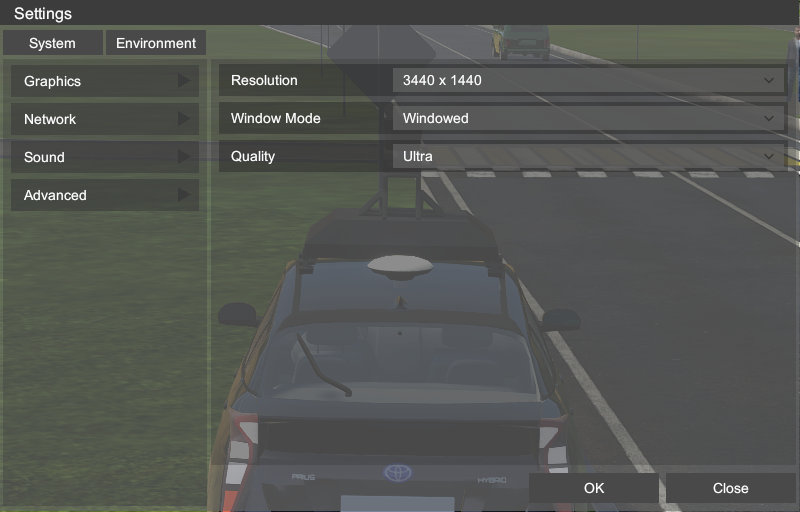
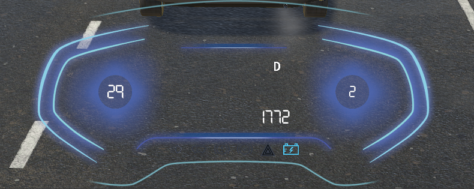
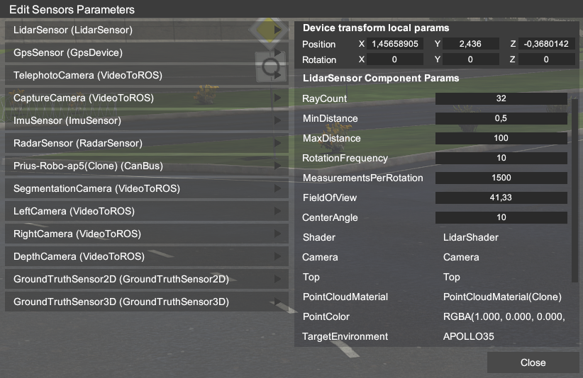
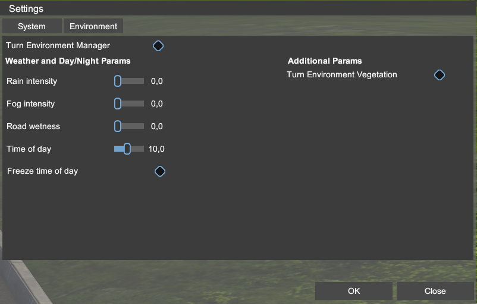
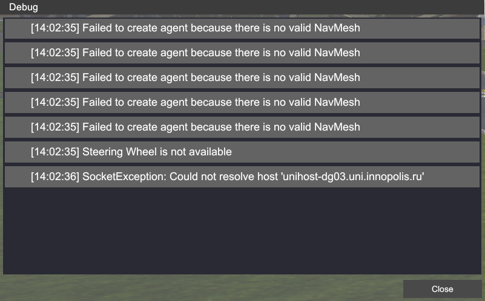
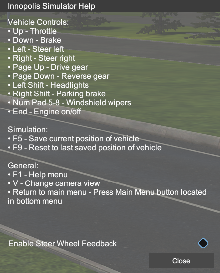

<h1 align="center">How to Use Innopolis Simulator</h1>


## How to Run

### For end-users
Download from <a href="https://github.com/inno-robolab/InnoSimulator/releases/latest" style="text-decoration: none">here</a> the latest release and run as a standalone executable.

There're three ways to run it, launch a terminal window and go to the folder you extracted InnoSimulator to.

 **1. Regular Launch**

 - On Linux
    
    ```
    chmod +x InnoSimulator.x86_64 # Only at first launch
    ./InnoSimulator.x86_64
    ```
 - On Windows
   
    ```
    InnoSimulator.exe # Or launch directly executable file from directory where it's located
    ```
 **2. Parameterized Launch**

In terminal window (same procedure as in regular launch) you have to add parameters after executable file. Currently there's only one parameter supported (launching simulator with config file that contains premade paramenters for vehicle, sensors, scene and etc). In the future we planning to extend of parameters. Config file example you can find [here](../Assets/Config/config.yaml).

 - On Linux
 
    ```
    ./InnoSimulator.x86_64 --config config.yaml
    ```
 - On Windows
    
    ```
    InnoSimulator.exe --config config.yaml
    ```

 **3. Launch using python script**

Python scripts allow to achive flexibilty for user. How to install and configure packages can be found [here](../Docs/PythonApi.md).

Before using scripts, you have to launch InnoSimulator in regular mode. Then open terminal window and go the locatation where python package and required script are placed.

- On Linux, Mac OS X and other POSIX systems:

    ```
    python script_file.py
    ```

- On Windows, use the `py`:

    ```
    py script_file.py
    ```

After launch, the scene defined in pyhton script will be started and scenario will run.


## Simulator Run Instructions and Functional Features

**First 3 items are necessary if you planning to launch simulator in the regular mode, because all required parameters are already set in config file or in the script**

1. There will be `Main Menu` after the simulator startup.

2. Here you can select required scene, vehicle type and remote address (Apollo 3 support depricated and 3.5/5).

3. Then press `Launch` button.

4. After scene will be loaded, the autonomous moving object should spawn inside of a chosen map. You will see...
    

5. In the bottom of the screen you can see a control bar. To start simaltions the simulator have to be connected to Apollo. 
If connection was established successfully Rosbridge connection status on control bar should change from `Connecting` to `Connected`.

    

    By pressing  you will open main control panel.

    

6. When connection will be established, you can start the simulations. Before starting the simulation you have to enable all required modules.

    

    Every option here turns on/off related sensor.

7. Settings control panel allows to make flexible configruration right inside the simulator.

    

    `Vehicle Position Reset` allows to place autonomous object to it's start posistion

    `Spawn Traffic Vehicle` spawns traffic car ib defined area (this feature is currently turned off)

    `Show Vehicle Info` shows vehicle's info (UI comming soon)

    `Settings` opens settings window (System part)
    
    
    
    `Show Dashboard HUD` shows dashboard UI
    
    
    
    `Custom Traffic Scenario` comming soon

    `Edit Sensors Parameters` allows to edit all sensors parameters in runtime
      
    
    
     **<span style='color: red;'>Notice - when you changed `Topic Name` field while simulator is already connected, you have to reconnect to Apollo. Otherwise changes won't be applied. </span>**
    
    `Main Menu` retruns to main menu
    `Environment` opens settings window (Environment part)
    
    
    
    `Analyzer` UI is comming soon
    `Debug` opens debug window (catches internal output debug messages)
    
    
    
    `Help` opens help window (also press `F1` button on your keyboard) 
    
    
      

    **<span style='color: red;'>Notice - This section will be updated in order as new updates and features are coming out. </span>**

## Internal Development Features
Desc is comming soon


## Supported Models and Features

Currently InnoSimulator supports car (Hyundai Santa Fe, Toyota Prius), track (Kamaz 43118) and UAV (DJI M100 and Zilant 15 Vtol) models. How use aerial vehicles you can find <a href="https://github.com/InnopolisAero/inno_sim_interface" style="text-decoration: none">here</a>.

This is the full list of features included in this simulator. This list will be updated as new features are added.

```
    -  Vehicle's control 
    -  Vehicle's parameters configuration 
    -  GPS 
    -  IMU 
    -  Radar
    -  Lidar
    -  Cameras
    -  Rosbridge
    -  Traffic
    -  Pedestrian scenarious
    -  Mapping and map generator 
    -  Geo Coding
    -  2D and 3D ground truth 
    -  Procedural buildings and roads generator
    -  Road network creator
    -  HD Map creation and export
    -  Day/night changer
    -  Weather 
    -  VR Support (Oculus)
    -  Logitech G920 support
```

## Requirements
For good framerate and performance the system minimum recommended for the Inno Simulator is the following: 
 - 4 GHz Dual core CPU
 - Nvidia GTX 1080
 - Windows 10 / Linux 64 Bit
 
#### External Devices Support

 - Oculus
 - Logitech G920 (only on Windows, driver you can find [here](https://www.driverscloud.com/en/services/GetInformationDriver/72261-75878/logitech-lgs-90265-x64-logitechexe))
